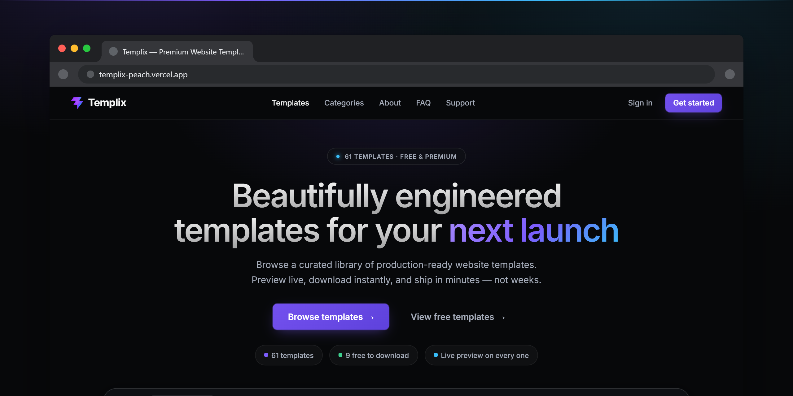
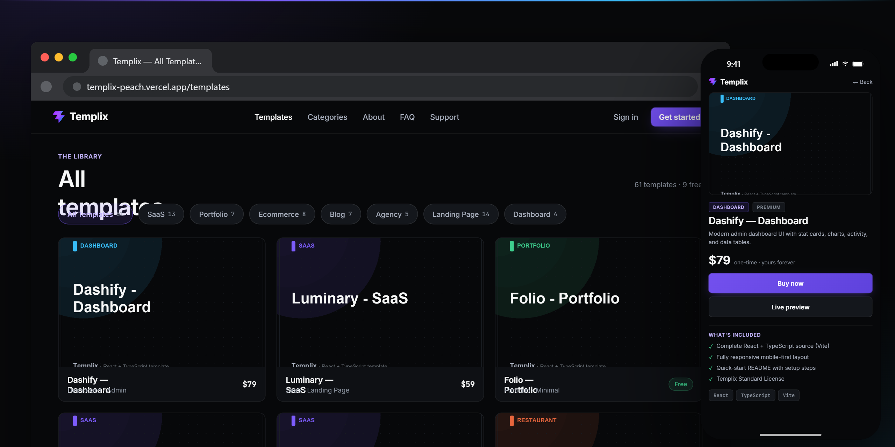
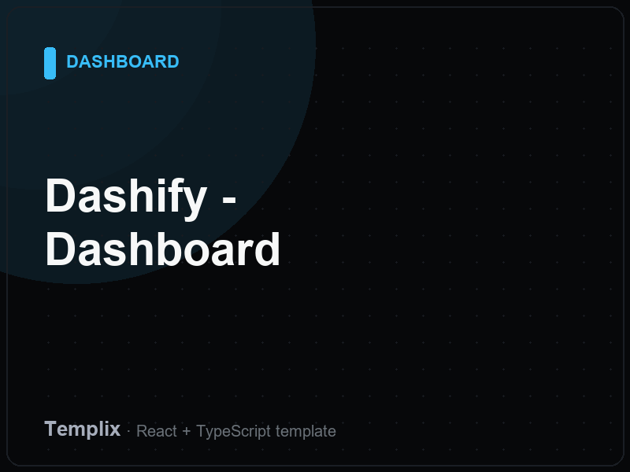
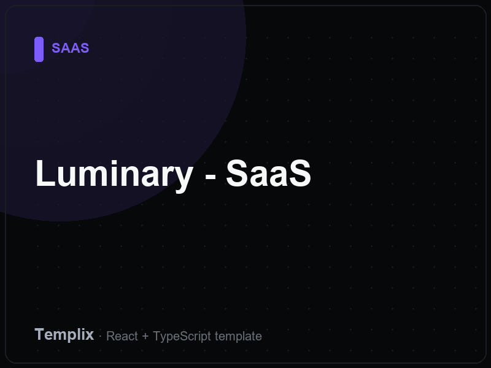
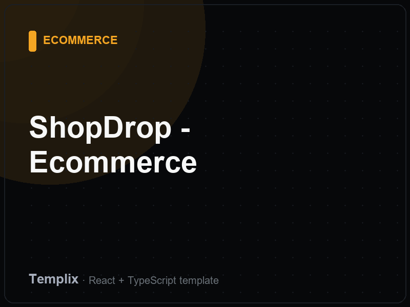
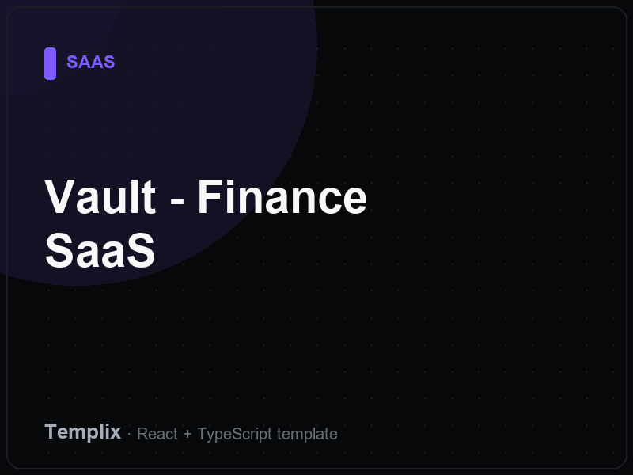
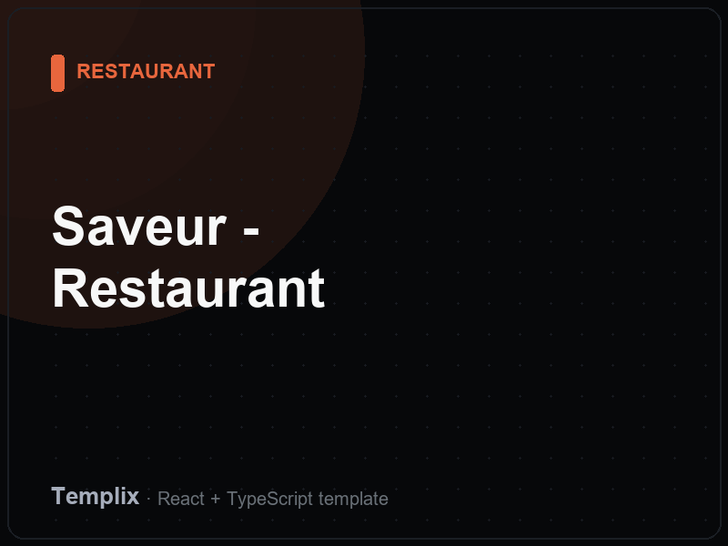

# Templix

**A premium website template marketplace: browse 61 hand-built templates, preview each one live, and buy securely through Stripe.** Built for freelancers, agencies, and founders who need a production-quality site design without starting from a blank page.


[](https://templix-peach.vercel.app)

## Live Demo

**[templix-peach.vercel.app](https://templix-peach.vercel.app)**: explore the full catalog and open any of the 61 live template previews.

## About

Template marketplaces live or die on trust: buyers want to see exactly what they are paying for, and sellers need payments and downloads that cannot be gamed. Templix solves both. Every template in the catalog has a real, fully interactive live preview rendered in the browser, not a static screenshot, wrapped in a dark "Obsidian Gallery" UI designed to make the products the hero. Behind the storefront sits a serverless Supabase + Stripe backend where prices, ownership, and downloads are all enforced server-side.

## Key Features

- **61 real templates** across SaaS, e-commerce, dashboards, agencies, restaurants, healthcare, real estate, and more: each with its own live, interactive preview route
- **Live preview gallery**: visitors test-drive the actual template before buying, with each preview loading as its own on-demand chunk
- **Secure Stripe checkout**: prices are resolved from a trusted server-side catalog; the client can never tamper with what it pays
- **Ownership-gated downloads**: premium zips live in a private storage bucket and are released only via short-lived signed URLs after a purchase check
- **Account system**: email sign-up, login, and password reset backed by Supabase Auth, with a protected purchases dashboard
- **Wishlist**: save templates for later without an account round-trip
- **Free tier**: 9 templates are free to download, so visitors can evaluate quality before spending anything
- **Polished UX details**: skip-to-content link, error boundaries, per-page SEO metadata, sitemap and robots.txt, custom 404

## Tech Stack

| Layer | Technology |
|---|---|
| Frontend | React 19, TypeScript, Vite 8 |
| Styling | Tailwind CSS 4, lucide-react icons |
| Routing | React Router 7 (75+ routes, all lazy-loaded) |
| Auth & Data | Supabase (Auth, Postgres, private Storage) |
| Payments | Stripe Checkout + webhooks via Supabase Edge Functions (Deno) |
| Hosting | Vercel (SPA rewrites, security headers, immutable asset caching) |

## Screenshots





A few of the 61 template covers from the catalog:

| | | |
|---|---|---|
|  |  |  |
|  |  |  |

## Quick Start

```bash
git clone https://github.com/w4seemdev/Templix.git
cd Templix
npm install

# Configure environment
cp .env.example .env
# then fill in:
#   VITE_SUPABASE_URL            your Supabase project URL
#   VITE_SUPABASE_ANON_KEY       your Supabase anon/publishable key
#   VITE_STRIPE_PUBLISHABLE_KEY  your Stripe publishable key

npm run dev       # local dev server
npm run build     # type-check + production build
npm run lint      # ESLint
```

### Backend setup (for the full purchase flow)

The payment and download pipeline runs on three Supabase Edge Functions in `supabase/functions/`:

1. `create-checkout`: creates the Stripe Checkout session (`supabase functions deploy create-checkout`)
2. `stripe-webhook`: records purchases after Stripe confirms payment (`supabase functions deploy stripe-webhook --no-verify-jwt`, then register the endpoint in the Stripe dashboard)
3. `verify-download`: issues signed download URLs to verified owners (`supabase functions deploy verify-download`)

They require the function secrets `STRIPE_SECRET_KEY`, `STRIPE_WEBHOOK_SECRET`, and `SUPABASE_SERVICE_ROLE_KEY`, a `purchases` table, and a **private** storage bucket named `templates` containing the premium zips as `<templateId>.zip` (see the comments at the top of each function for details).

## Engineering Highlights

- **Zero-trust checkout**: the browser sends only a `templateId`. The price comes from a server-side catalog inside the edge function, and the buyer's identity comes from the verified Supabase JWT, never from the request body. Tampering with the client cannot change what gets charged or who gets credited.
- **Single writer for purchases**: the signature-verified Stripe webhook is the only code path that can insert a `purchases` row, it only fulfils sessions Stripe reports as `paid`, and it is idempotent on the Stripe session id so webhook retries never create duplicates.
- **Gated downloads**: premium files never sit on a public URL. The `verify-download` function authenticates the caller, checks ownership in the database, and returns a signed URL that expires after 60 seconds.
- **Hardened delivery**: `vercel.json` ships `X-Frame-Options`, `Content-Security-Policy: frame-ancestors`, `X-Content-Type-Options`, `Referrer-Policy`, and `Permissions-Policy` on every response, with immutable long-cache headers for hashed assets.
- **Aggressive code splitting**: the initial bundle contains only the homepage; every secondary page and each of the 61 template previews is its own lazy chunk, so visitors download only the demo they open.

## What This Project Demonstrates

- Architecting a large React SPA (75+ routes, 61 product previews) that stays fast through route-level code splitting
- Full-stack payment integration: Stripe Checkout, signature-verified webhooks, and idempotent order fulfilment
- Serverless backend design with Supabase Edge Functions, Postgres, and private object storage
- Security-first thinking: server-side price authority, JWT-verified identity, expiring signed URLs, and HTTP security headers
- Modern TypeScript tooling: Vite 8, Tailwind CSS 4, strict ESLint, and a type-checked production build

---

Built by **Waseem Abu Fares**, [github.com/w4seemdev](https://github.com/w4seemdev)
